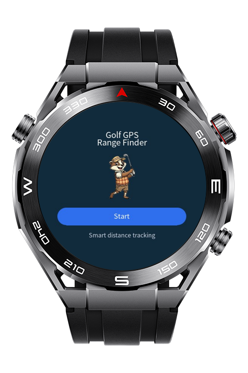
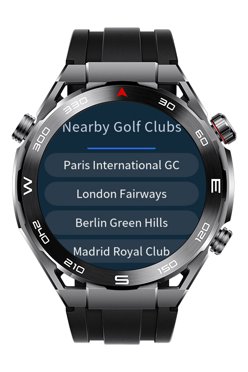
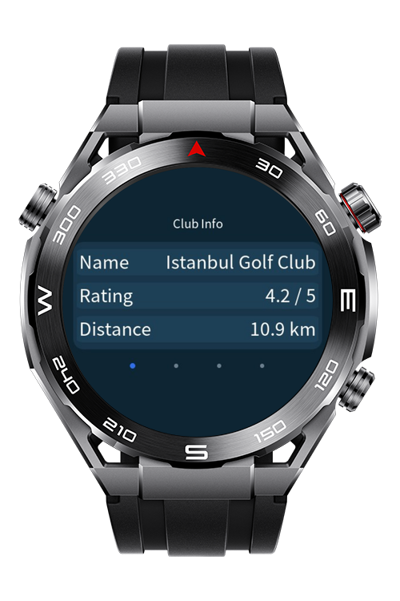

> **Note:** To access all shared projects, get information about environment setup, and view other guides, please visit [Explore-In-HMOS-Wearable Index](https://github.com/Explore-In-HMOS-Wearable/hmos-index).

# Golf Gps Finder Lite

GolfGPSFinderLite is a HarmonyOS Lite wearable app that helps golfers locate nearby clubs, view course details, and start a round with distance and hole tracking.

# Preview

<p align="left">
  
  
  
</p>

# Use Cases

- Locating nearby golf clubs based on current GPS location
- Viewing club details including holes, par, and rating
- Accessing club contact and address info
- Tracking strokes per hole with live distance to target
- Calculating GPS distance to the next hole

# Tech Stack

- **Languages**: JS
- **Frameworks**: HarmonyOS SDK 4.0.0(10)
- **Tools**: DevEco Studio Vers 5.1.0.842
- **Libraries**: @ohos.geolocation

# Directory Structure

```
entry/
└── src/
    └── main/
        ├── js/
        │   └── MainAbility/
        │       ├── app.js
        │       │
        │       ├── i18n/
        │       │   ├── en-US.json
        │       │   └── zh-CN.json
        │       │
        │       └── pages/
        │           ├── index/
        │           │   ├── index.css
        │           │   ├── index.hml
        │           │   ├── index.js
        │           │   └── mascot.png
        │           │
        │           ├── clubs/
        │           │   ├── clubs.css
        │           │   ├── clubs.hml
        │           │   └── clubs.js
        │           │
        │           ├── clubDetail/
        │           │   ├── clubDetail.css
        │           │   ├── clubDetail.hml
        │           │   └── clubDetail.js
        │           │
        │           └── game/
        │               ├── game.css
        │               ├── game.hml
        │               └── game.js
        │
        └── resources/
            ├── config.json
            └── syscap.json

```

# Constraints and Restrictions

## Supported Devices

 - Huawei Sport (Lite) Watch GT 4/5/6
  - Huawei Sport (Lite) GT4/5 Pro
  - Huawei Sport (Lite) Fit 3/4
  - Huawei Sport (Lite) D2
  - Huawei Sport (Lite) Ultimate

# LICENSE

Golf Gps Finder Lite is distributed under the terms of the MIT License.
See the [LICENSE](/LICENSE) for more information.
